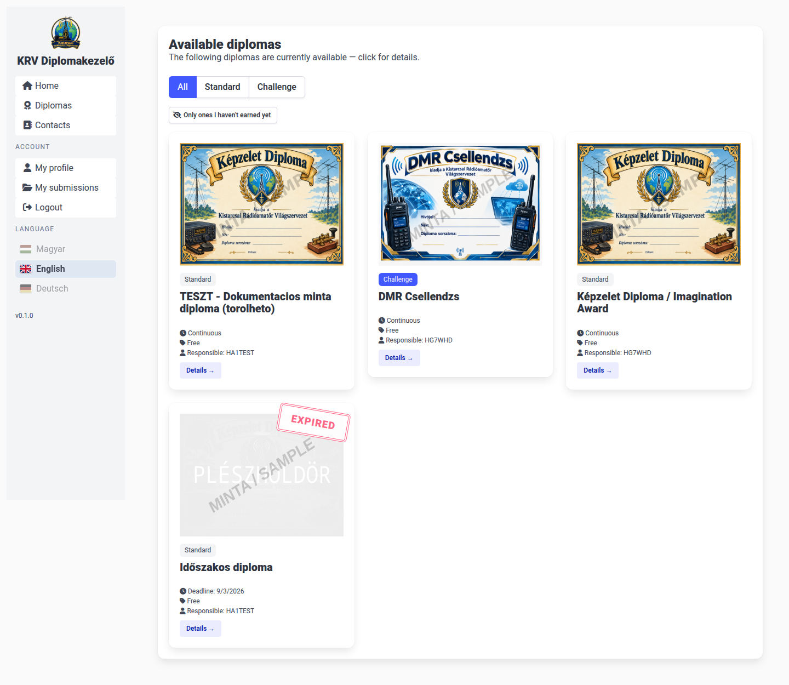

# Ham Diploma Publisher

A web application for publishing and managing amateur radio diplomas (awards/certificates).

A diploma manager defines a rule set and uploads a blank certificate image; a radio amateur
registers, uploads their log (ADIF), and the system automatically checks whether the
requirements are met — optionally sampling a few contacts for QSL confirmation. The manager
reviews the submission (or, if the diploma is configured for it, the system approves it
automatically), the radio amateur is notified by email and can download the PDF certificate,
and optionally pays for a physical (framed) copy via Stripe, PayPal, or bank transfer.



## Features

- **Diploma administration** — flexible rule engine (checklist or points-based), zone-based
  (home/EU/DX) minimum scores, wildcard/regex/list callsign matching, band and mode rules
  (including mode/band groups), tiers and categories, a drag-and-drop certificate layout
  editor, and a separate "Challenge" diploma type with per-round random draws.
- **Automatic approval** — a diploma can be configured so that a submission the system finds
  automatically eligible is approved immediately, without manager review (only available
  without QSL sampling or physical delivery).
- **QSL sampling** — the system can randomly draw a configurable number of contacts and
  require a QSL confirmation image for each before the submission goes to review.
- **PDF certificates** — generated with Puppeteer from the manager-configured blank image
  and field layout, with an atomically assigned serial number.
- **Payments** — Stripe Checkout, PayPal Orders, or manually confirmed bank transfer, for
  the PDF and/or a physical framed copy.
- **Two-factor authentication (MFA)** — email code or TOTP authenticator app, with a
  configurable policy per role (radio amateur / manager).
- **A custom "amateur radio" check at registration** — instead of a generic captcha, a
  question about which amateur band a given frequency falls into.
- **User management** — a searchable, paginated admin view for superadmins, with the
  ability to disable/re-enable accounts and grant/revoke the manager role.
- **A free-form "Contacts" page** — editable by the manager, HTML included.
- **Cloud storage** — a local filesystem driver for development, and an S3-compatible driver
  (e.g. Backblaze B2, Cloudflare R2, MinIO) for production.
- **Multi-language** — Hungarian, English, German, switchable per visitor/account.

## Tech stack

- [Total.js 4](https://totaljs.com/) (Node.js) backend
- MongoDB, Redis (sessions, MFA/captcha/password-reset tokens)
- Native JS frontend with [Bulma](https://bulma.io/) CSS — no frontend framework/build step
- [Puppeteer](https://pptr.dev/) for certificate/PDF rendering
- Docker Compose for local development (app + MongoDB + Redis + [MailHog](https://github.com/mailhog/MailHog) for catching outgoing email)

## Quick start (local development)

```bash
cp docker/dev.env.example docker/dev.env    # then edit as needed
cp src/config.example src/config            # then fill in the REQUIRED values (see below)
docker compose -f docker/docker-compose-dev.yml up
```

The app is then available at <http://127.0.0.1:8000>, and the MailHog web UI (catches every
outgoing email in dev, nothing is sent for real) at <http://127.0.0.1:8026>.

The first account registered with the email address set in `SUPERUSER_EMAIL` (see
`docker/dev.env`) automatically becomes a superadmin.

## Configuration

Two files carry configuration, and neither is committed (only their `.example` templates
are) — copy each one next to itself and fill it in before first run:

| File | Purpose |
| --- | --- |
| `docker/dev.env` (from `docker/dev.env.example`) | Local Docker Compose environment — DB connection strings, `SUPERUSER_EMAIL`, mail/storage/payment settings, etc. |
| `src/config` (from `src/config.example`) | The app's own defaults, incl. **`secret`/`encryptKey`** (session-cookie signing/encryption — generate a random, unique value for each, e.g. `openssl rand -base64 32`) and `HDP_USER_HASH_SALT` (password-hash salt). |

**Every value in both files can also be provided as an environment variable instead**, which
takes priority over the file — this is the recommended way to configure a production/Docker/
Kubernetes deployment (inject via a `Secret`/`ConfigMap` rather than baking values into an
image or a mounted file):

- `secret` / `encryptKey` → env vars `SECRET` / `ENCRYPT_KEY`.
- Every other, `HDP_*`-prefixed key in `src/config` (e.g. `HDP_SUPERUSER_EMAIL`,
  `HDP_S3_ACCESS_KEY`, `HDP_STRIPE_SECRET_KEY`, ...) → the same name **without** the `HDP_`
  prefix (e.g. `SUPERUSER_EMAIL`, `S3_ACCESS_KEY`, `STRIPE_SECRET_KEY`). This is exactly how
  `docker/dev.env` overrides them in local development.

See [CLAUDE.md](CLAUDE.md)'s "Configuration" section for the implementation details.

## Documentation

- [CLAUDE.md](CLAUDE.md) — architecture, conventions, and framework gotchas for anyone
  developing this project (human or AI agent).
- [docs/USER_DOC.md](docs/USER_DOC.md) — pointer to the screenshot-illustrated user manual
  under [docs/user-manual/](docs/user-manual/).

  The manual's pages are plain, self-contained HTML files (viewable offline, no server
  needed) — GitHub itself only shows their raw source rather than rendering them, so for a
  proper in-browser reading experience, enable **GitHub Pages** for this repository once it's
  pushed (Settings → Pages → Deploy from a branch → branch `main`, folder `/docs` — no further
  setup needed, the folder is already laid out for this). It'll then be reachable at
  `https://<your-org-or-user>.github.io/<repo-name>/user-manual/index.html`. Until then (or as
  a fallback), clone the repo and open `docs/user-manual/index.html` directly in a browser.

## Project status

This project is under active development.

## License

[MIT](LICENSE)
